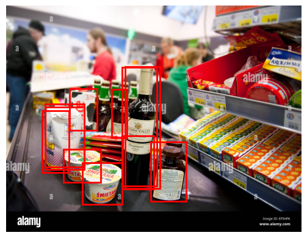
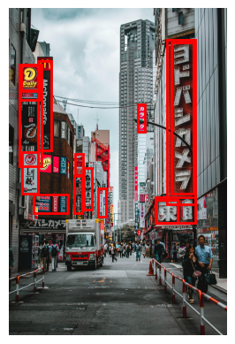

# ZSOD - Zero Shot Object Detection 

## Overview

Zero-shot Object detection to enhance the performance and accuracy of detection and recognation applications. This methodology expands the capabilities of traditional object detection systems by allowing them to recognize and classify objects even without specific training examples.

<p align="center">
    
    
</p>


## Features

- Applying Zero-shot object detection using Clip , Owl-VIT

## Installation

To use ZSOD, follow these steps:

1. Clone the repository:

   ```bash
   git clone https://github.com/Alaaeldinn/ZSOD.git
   ```

2. Install requirements:

   ```bash
   pip install -r requirements.txt
   ```
   
